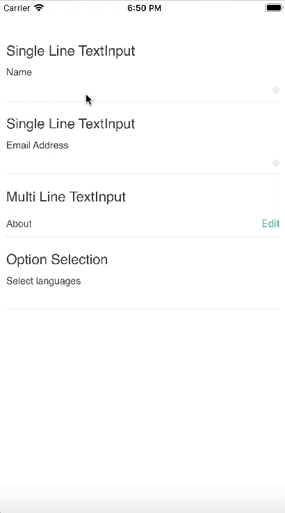

<h1>Introduction</h1>

INTUZ is presenting an interesting Rich TextInput to integrate inside your React Native based application. This component is  providing extensive support for both Android and iOS platforms. Please follow below steps to integrate this control in your next project.

<br>
<h1>Features</h1>

- Three Types TextInput
    1) SingleLine TextInput
    2) MultiLine TextInput
    3) OptionsList with Single and Multi Selections TextInput
- When TextInput with options then pass array of json object (Need to pass label and selected when use the json object for Option selection TextInput.)
- Customize TextInput with your own style for Title and InputText Style
- When TextInput is focus then enable clear button and not focus then show dot.

<br>


<h1>Getting Started</h1>

> Import INTRichTextInput in your .js file

```
import INTRichTextInput from './app/component/INTRichTextInput'
```

> Render INTRichTextInput

- SingleLine INTRichTextInput
```
<INTRichTextInput
    inputStyle={{ flex: 1, paddingVertical: 6, color: '#6D6D6D', fontFamily: 'Helvetica' }}
    wrapperStyle={{}}
    placeholderTextColor={"#434343"}
    autoCorrect={false}
    placeholder={""}
    maxLength={255}
    selectionColor={"#454545"}
    borderColor={'#6D6D6D'}
    onChangeText={(name) => this.setState({ name })}
    value={this.state.name}
    borderWidth={0}
    title={"Name"}
    titleStyle={{ backgroundColor: 'transparent', color: '#484848', fontFamily: 'Helvetica', fontSize: 14, alignItems: 'center' }}
    showErrorIcon={true}
    editType={0}//For Singleline
/>
```
- MultilineLine INTRichTextInput
```
<INTRichTextInput
    inputStyle={{ flex: 1, paddingVertical: 6, color: '#6D6D6D', fontFamily: 'Helvetica' }}
    wrapperStyle={{}}
    placeholderTextColor={"#434343"}
    autoCorrect={false}
    placeholder={""}
    // maxLength={255}
    selectionColor={"#454545"}
    borderColor={'#6D6D6D'}
    onChangeText={(about) => this.setState({ about })}
    value={this.state.about}
    autoGrow={true}
    borderWidth={0}
    title={"About"}
    subTitle={"A quick tidbit so your doula can get to know you."}
    titleStyle={{ backgroundColor: 'transparent', color: '#545454', fontFamily: 'Helvetica', fontSize: 14, alignItems: 'center' }}
    showErrorIcon={true}
    editType={1}//For Multiline
/>
```

- OptionsList INTRichTextInput
```
<INTRichTextInput
    inputStyle={{ flex: 1, paddingVertical: 6, color: '#6D6D6D', fontFamily: 'Helvetica' }}
    wrapperStyle={{}}
    placeholderTextColor={"#434343"}
    autoCorrect={false}
    placeholder={""}
    maxLength={255}
    selectionColor={"#454545"}
    borderColor={'#6D6D6D'}
    onChangeText={(options) => this.setState({ options })}
    value={this.state.options}
    borderWidth={0}
    title={"Select languages"}
    titleStyle={{ backgroundColor: 'transparent', color: '#484848', fontFamily: 'Helvetica', fontSize: 14, alignItems: 'center' }}
    showErrorIcon={true}
    //Selections
    arrSelections={[{lable:"Gujarati",selection:true},{lable:"English",selection:false}]}
    isSingleSelection={false}
    editType={2}//For Options
/>
```

<br>
<h1>Properties</h1>

| Available properties 	| Type 	| Default Value 	| Required 	| Description 	|
|--------------------------	|-----------------------------------	|--------------------------------------------	|----------	|------------------------------------------------------------------------------------------------------------------------------------------------------------------------	|
| inputStyle 	| Style 	| { flex: 1, fontSize: 16, height: null, textAlignVertical: 'center', color: '#6D6D6D' } 	| No 	| Style your Rich TextInput 	|
| wrapperStyle     | Style     | {flexDirection: 'row', justifyContent: 'center'} | No     | Style your Rich TextInput     |
| placeholderTextColor 	| String(color) 	| {"#434343"} 	| No 	| Color of TextInput Placholder 	|
| placeholder 	| String 	| - 	| No 	| Place Holder String of TextInput	|
| maxLength     | Number     | -     | No     | Max number of charcter to allow     |
| selectionColor     | String(color)     | {"#454545"}     | No     | Color of Cursor    |
| borderColor     | String(color)     | {"#6D6D6D"}     | No     | TextInput border color    |
| borderWidth     | Number     | {0}     | No     | Width of border    |
| title     | String     | -     | No     | Title of the TextInput    |
| titleStyle     | Style     |{flex: 1, fontSize: 14, color: '#484848', paddingVertical: 2, position: 'absolute', bottom: 0, alignSelf: 'flex-start', textAlign: "left",}     | No     | Style your Rich TextInput     |
| showErrorIcon 	| Boolean (true/false) 	|  -	| Yes 	| True if want to display right icon with (dot, clear, check)|
| editType     | Number     | -     | Yes     | 0 - SingleLine, 1 - Multiline, 2 - Option List Selection    |
| arrSelections     | Array     | -     | If(editType == 2) ? Yes : No     | Array of show option listing     |
| isSingleSelection     | Boolean (true/false)     |  If(editType == 2) ? Yes : No    | Yes     | True if single selection from optionlist|
<br>
<h1>Bugs and Feedback</h1>

For bugs, questions and discussions please use the Github Issues.

<br>
<h1>License</h1>

Copyright (c) 2018 INTUZ.
<br><br>
Permission is hereby granted, free of charge, to any person obtaining a copy of this software and associated documentation files (the "Software"), to deal in the Software without restriction, including without limitation the rights to use, copy, modify, merge, publish, distribute, sublicense, and/or sell copies of the Software, and to permit persons to whom the Software is furnished to do so, subject to the following conditions:
<br><br>
THE SOFTWARE IS PROVIDED "AS IS", WITHOUT WARRANTY OF ANY KIND, EXPRESS OR IMPLIED, INCLUDING BUT NOT LIMITED TO THE WARRANTIES OF MERCHANTABILITY, FITNESS FOR A PARTICULAR PURPOSE AND NONINFRINGEMENT. IN NO EVENT SHALL THE AUTHORS OR COPYRIGHT HOLDERS BE LIABLE FOR ANY CLAIM, DAMAGES OR OTHER LIABILITY, WHETHER IN AN ACTION OF CONTRACT, TORT OR OTHERWISE, ARISING FROM, OUT OF OR IN CONNECTION WITH THE SOFTWARE OR THE USE OR OTHER DEALINGS IN THE SOFTWARE.

<h1></h1>
<a href="http://www.intuz.com">

</a>
